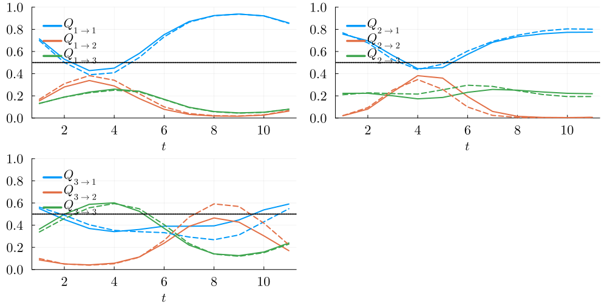

# SmoothPeriodicStatsModels

[](https://github.com/dmetivie/SmoothPeriodicStatsModels.jl/actions/workflows/CI.yml?query=branch%3Amaster)

This package is primarily built to be an extension of the [StochasticWeatherGenerators](https://github.com/dmetivie/StochasticWeatherGenerators.jl) package. See the [tutorial](https://dmetivie.github.io/StochasticWeatherGenerators.jl/dev/examples/tuto_paper/) for an example of usage.

It builds several smooth versions of statistical models for time series, currently including:

- AR(1) Auto-Regressive model of order 1
- Mixture Models
- Auto-Regressive Periodic Hidden Markov Model. For now, it only has Bernoulli mixture emission distributions, i.e., conditionally independent distributions.

**Smooth** means that temporal coefficients of the models e.g., $p(t)\in [0,1]$ for Bernoulli parameter and $t\in [1,T]$ have a periodic functional form to enforce smoothness i.e., $p(t)\simeq p(t+1)$.
Note that the package [PeriodicHiddenMarkovModels.jl](https://github.com/dmetivie/PeriodicHiddenMarkovModels.jl) also deals with Periodic HMM, but right now, it does not enforce smoothness; hence if you don't have many observations, you can have $p(t)$ very different from $p(t+1)$. Moreover, this causes identifiability issues of the hidden states.

The HMM part of this package could be moved at some point to [PeriodicHiddenMarkovModels.jl](https://github.com/dmetivie/PeriodicHiddenMarkovModels.jl), making use under the hood of the very nice and flexible [HiddenMarkovModels.jl](https://github.com/gdalle/HiddenMarkovModels.jl) package.

This is inspired by seasonal Hidden Markov Models; see [A. Touron (2019)](https://link.springer.com/article/10.1007/s11222-019-09854-4) and used in the paper [Interpretable Seasonal Multisite Hidden Markov Model for stochastic rain generation in France](https://hal.inrae.fr/hal-04621349).

## Example

### Set up

```julia
using SmoothPeriodicStatsModels
using Random
```

```julia
Random.seed!(2020)
K = 3 # Number of hidden states
T = 11 # Period
N = 49_586 # Length of observation
D = 6 # Dimension of observed variables
autoregressive_order = 1

size_order = 2^autoregressive_order
degree_of_P = 1
size_degree_of_P = 2*degree_of_P + 1 

trans_θ = 4*(rand(K, K - 1, size_degree_of_P) .- 1/2)
Bernoulli_θ = 2*(rand(K, D, size_order, size_degree_of_P) .- 1/2)
hmm = Trig2ARPeriodicHMM([1/3, 1/6, 1/2], trans_θ, Bernoulli_θ, T)
```

### Simulations

```julia
z_ini = 1
y_past = rand(Bool, autoregressive_order, D)
n2t = SmoothPeriodicStatsModels.n_to_t(N,T)
z, y = rand(hmm, n2t; y_ini=y_past, z_ini=z_ini, seq=true)
```

### Fit

```julia
trans_θ_guess = rand(K, K-1, size_degree_of_P)
Bernoulli_θ_guess = zeros(K, D, size_order, size_degree_of_P)
trans_θ_guess[:,:,1] .= trans_θ[:,:,1] # cheating on initial guess to recover very good MLE maxima
Bernoulli_θ_guess[:,:,:,1] = Bernoulli_θ[:,:,:,1]
hmm_guess = Trig2ARPeriodicHMM([1/4, 1/4, 1/2], trans_θ_guess, Bernoulli_θ_guess, T)

@time "FitMLE SHMM (Baum Welch)" hmm_fit, θq_fit, θy_fit, hist, histo_A, histo_B = fit_mle(hmm_guess, trans_θ_guess, Bernoulli_θ_guess, y, y_past, maxiter=10000, robust=true; display=:iter, silence=true, tol=1e-3, θ_iters=true, n2t=n2t);
# EM converged in 317 iterations, logtot = -194299.4177103428
# FitMLE SHMM (Baum Welch): 72.532794 seconds (344.65 M allocations: 27.641 GiB, 3.59% gc time)
```

### Plots

<details close>

<summary>Code for the plot</summary>

```julia
using LaTeXStrings, Plots
using Distributions: succprob

default(fontfamily="Computer Modern", linewidth=2, label=nothing, grid=true, framestyle=:default, legendfontsize=14, foreground_color_legend=nothing, background_color_legend=nothing, tickfontsize=14, xlabelfontsize=14, ylabelfontsize=14)

begin
    pA = [plot() for k in 1:K]
    for k in 1:K
        [plot!(pA[k], hmm.A[k, l, :], c=l, label=L"Q_{%$(k)\to %$(l)}", legend=:topleft) for l in 1:K]
        [plot!(pA[k], hmm_fit.A[k, l, :], c=l, label=:none, legend=:topleft, s = :dash) for l in 1:K]

        hline!(pA[k], [0.5], c=:black, label=:none, s=:dot)
        ylims!(0,1)
        xlabel!(pA[k], L"t")
    end
    pallA = plot(pA..., size=(1000, 500), bottom_margin=3Plots.mm)
end

begin
    mm = 1 # H = 1  <=> {Y_{t-1} = 0}
    pB = [plot() for j in 1:D]
    for j in 1:D
        [plot!(pB[j], succprob.(hmm.B[k, :, j, mm]), c=k, label=:none) for k in 1:K]
        [plot!(pB[j], succprob.(hmm_fit.B[k, :, j, mm]), c=k, label=:none, s = :dash) for k in 1:K]

        hline!(pB[j], [0.5], c=:black, label=:none, s=:dot)
        ylims!(pB[j], (0, 1))
        xlabel!(pB[j], L"t")
        j==2 ? title!(pB[j], L"p(Y_t=1|Z=k, Y_{t-1} = 0)") : nothing
    end
    pallB = plot(pB..., size=(1000, 500), bottom_margin=3Plots.mm)
end

begin
    mm = 2 # H = 2 <=> {Y_{t-1} = 1}
    pB = [plot() for j in 1:D]
    for j in 1:D
        [plot!(pB[j], succprob.(hmm.B[k, :, j, mm]), c=k, label=:none) for k in 1:K]
        [plot!(pB[j], succprob.(hmm_fit.B[k, :, j, mm]), c=k, label=:none, s = :dash) for k in 1:K]

        hline!(pB[j], [0.5], c=:black, label=:none, s=:dot)
        ylims!(pB[j], (0, 1))
        xlabel!(pB[j], L"t")
        j==2 ? title!(pB[j], L"p(Y_t=1|Z=k, Y_{t-1} = 0)") : nothing
    end
    pallB = plot(pB..., size=(1000, 500), bottom_margin=3Plots.mm)
end
```

</details>




